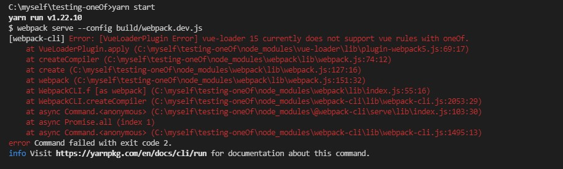

# testing-oneOf
Test vue-loader does not support oneOf.
## install
```
yarn
```
## run
```
yarn start
```

## error
```
if use build->webpack.common.js  add oneOf code is error.
if use build->webpack.common.js  no oneOf code is correct.
```
### error show
